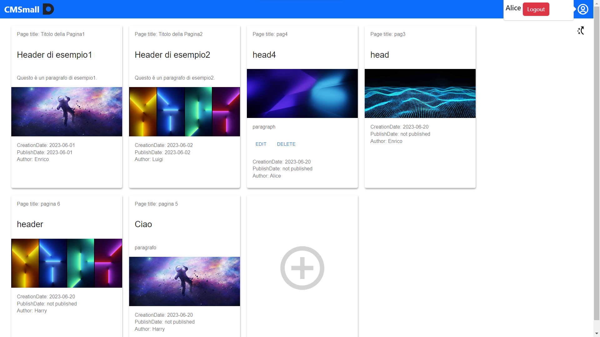
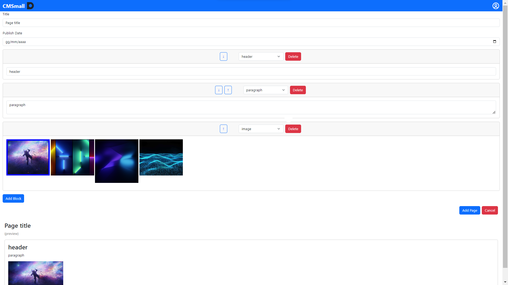

[](https://classroom.github.com/a/g5Hi-YAN)

# Exam #1: "CMSmall"

## Student: s319849 INTERRANTE BONADIA ALEKOS

## React Client Application Routes

- Route `/`: This route displays all published pages for unauthenticated users and shows all pages for authenticated
  users.
- Route `/login`: This route is used for user login.
- Route `/add`: This route allows users to add new pages, specifying all necessary parameters and blocks.
- Route `/edit/:pageId`: This route enables users to edit an existing page, allowing them to modify blocks, title, and
  publish date.
- Route `/delete/:pageId/:title`: This route presents a dialog page that confirms the deletion of a specific page,
  displaying the page title for verification.
- Route `/*`: This route handles invalid routes, displaying a custom error page and redirecting to a predefined route.

## API Server

- POST `/api/sessions`
    - Description: Create a new session starting from the given credentials.

  Request body:

```
{
  "username": "harry@test.com",
  "password": "pwd"
}
```

Response: `200 OK` (success) or `500 Internal Server Error` (generic error).

Response body: _None_

- GET `/api/sessions/current`
    - Description: Verify if the given session is still valid and return the info about the logged-in user. A cookie
      with a VALID SESSION ID must be provided to get the info of the user authenticated in the current session.
    - Request body: _None_
    - Response: `201 Created` (success) or `401 Unauthorized` (error).

Response body:

```
{
  "username": "harry@test.com",
  "id": 4,
  "name": "Harry",
  "administrator":false,
}
```

- GET `/api/users`
    - Description: Get all users in the database. A cookie with a VALID SESSION ID must be provided to get the info of
      the user authenticated in the current session and verify if is an administrator.
    - Response: `200 OK` (success) or `401 Unauthorized` (error) or `500 Internal Server Error` (generic error).

Response body:

```
[
{
"email": "harry@test.com",
"id": 4,
"name": "Harry",
},
{
"email": "enrico@test.com",
"id": 1,
"name": "Enrico",
}
]
```

- GET `/api/pages`
    - Description: Get all the pages and for each page an array of blocks of that page.
    - Request body: _None_
    - Response: `200 OK` (success) or `500 Internal Server Error` (generic error).
    - Response body: An array of objects, each describing a page with all blocks.

```
[{
    id: 1,
    title: "pagina 1",
    authorId: 1,
    authorName: "Enrico",
    creationDate: "20/06/2023",
    publishDate: "",
    blocks: [{      id: 1,                    
                    type: "header",
                    orderIndex: 1,
                    content: "header di esempio",
                    imagePath: "",},
                    ...],
},
...
]
```

- GET `/api/images`
    - Description: Get all the images.
    - Request body: _None_
    - Response: `200 OK` (success) or `500 Internal Server Error` (generic error).
    - Response body: An array of objects, each describing the images.

```
[{
    id: 1,
    imagePath: "img1.jpg",
},
...
]
```

- GET `/api/title`
    - Description: Get title of website .
    - Request body: _None_
    - Response: `200 OK` (success) or `500 Internal Server Error` (generic error).
    - Response body: One object describing the title name.

```
[{
    id: 1,
    titleName: "CMSmall",
}]
```

- POST `/api/pages`
    - Description: Add a new page to the list of the pages of the website. A cookie with a VALID SESSION ID
      must be provided. The user adding the page is taken from the session.If the user is administrator he can provide
      the author of the page.
    - Request body:  An object representing a page (Content-Type: `application/json`).

```
{
    id: 1,
    title: "pagina 1",
    authorId: 1,
    authorName: "Enrico",
    creationDate: "20/06/2023",
    publishDate: "",
    blocks: [{id: 1,
                    type: "header",
                    orderIndex: 1,
                    content: "header di esempio",
                    imagePath: "",},
                    ...],
}
```

- Response: `201 Created` (success) or `503 Service Unavailable` (generic error). If the request body is not
  valid, `422 Unprocessable Entity` (validation error). If
  the pageId does not exist, `404 Not Found`. If the request does not come on an authenticated
  session, `401 Unauthorized`.
- Response body: The id of the newly created page, as a JSON value (Content-Type: `application/json`).

```
{1}
```

- PUT `/api/pages/<id>`
    - Description: Update an existing page entirely, identified by its id. A cookie with a VALID SESSION ID must be
      provided. The user requesting the update the page must be the same as the page owner or can be an administrator.
    - Request body:  An object representing a page (Content-Type: `application/json`).

    ```
    {
        id: 1,
        title: "pagina 1",
        authorId: 1,
        authorName: "Enrico",
        creationDate: "20/06/2023",
        publishDate: "",
        blocks: [{id: 1,
                        type: "header",
                        orderIndex: 1,
                        content: "header di esempio",
                        imagePath: "",},
                        ...],
    }
    ```

    - Response: `200 OK` (success) or `503 Service Unavailable` (generic error). If the request body is not
      valid, `422 Unprocessable Entity` (validation error). If the request does not come from an authenticated
      session, `401 Unauthorized`.
    - Response body: _None_

- DELETE `/api/pages/<id>`
    - Description: Delete an existing page, identified by its id. A cookie with a VALID SESSION ID must be provided. The
      user requesting the page deletion must be the same as the page owner or an administrator.
    - Request body: _None_
    - Response: `204 No Content` (success) or `503 Service Unavailable` (generic error). If the request does not come
      from
      an authenticated session, `401 Unauthorized`.
    - Response body: _None_

- PUT `/api/title`
    - Description: Update the website title. A cookie with a VALID SESSION ID must be provided. The user requesting the
      title update must be an administrator.
    - Request body: An object representing the title (Content-Type: `application/json`).

      ```
      {
          id: 1,
          titleName: "CSM",
             }
      ```
        - Response:  `200 OK` (success) or `503 Service Unavailable` (generic error). If the request body is not
          valid, `422 Unprocessable Entity` (validation error). If the request does not come on an authenticated
          session and from an administrator, `401 Unauthorized`
        - Response body: _None_

## Database Tables

- Table `users` -contains
    * username: enrico@test.com, password: "pwd",administrator:"true"
    * username:  luigi@test.com, password: "pwd",administrator:"false"
    * username:  alice@test.com, password: "pwd",administrator:"false"
    * username:  harry@test.com, password: "pwd",administrator:"false"
    * username:  carol@test.com, password: "pwd",administrator:"false"
- Table `pages` - contains
    * title: "Titolo della Pagina1" ,authorId: 1 ,authorName: "Enrico",creationDate: "2023-06-01",publishDate: "
      2023-06-01"
    * title: "Titolo della Pagina2",authorId: 2 ,authorName: "Luigi",creationDate: "2023-06-02",publishDate: "
      2023-06-02"
    * title: "pag3" ,authorId: 1 ,authorName: "Enrico",creationDate: "2023-06-20",publishDate: "2023-07-18"
    * title: "pag4" ,authorId: 3 ,authorName: "Alice",creationDate: "2023-06-20",publishDate: "2023-07-10"
    * title: "pagina 5" ,authorId: 4,authorName: "Harry",creationDate: "2023-06-20",publishDate: ""
    * title: "pagina 6",authorId: 4 ,authorName: "Harry",creationDate: "2023-06-20",publishDate: ""

- Table `content_blocks` - contains
    * pageId: 1,type:"header",orderIndex: 1, content:"header di esempio",imagePath:""
    * pageId: 1,type:"image",orderIndex: 3, content:"",imagePath:"/img1.jpg"
    * ...

- Table `images` - contains
    * imagePath: "img1.jpg"
    * imagePath: "img2.png"
    * imagePath: "img3.jpg"
    * imagePath: "img4.jpg"
- Table `title` -contains
    * titleName: "CMSmall"

## Main React Components

- `LoginForm` (in `AuthComponents.jsx`): component for user login
- `FormRoute` (in `FormRoute.jsx`): component for add and edit a page with all properties
- `NavHeader` (in `NavbarComponents.jsx`): component for edit the title of the website and for access to the information
  of the logged user (name of user and if is administrator)
- `PageRoute` (in `PagesRoutes.jsx`): component for display all pages for logged users and only published pages for the
  others. Logged users can switch from front-office to back-office with the button on the top-right of the page.

## Screenshot




## Users Credentials

* username:  enrico@test.com, password: "pwd"
* username:  luigi@test.com, password: "pwd"
* username:  alice@test.com, password: "pwd"
* username:  harry@test.com, password: "pwd"
* username:  carol@test.com, password: "pwd"

